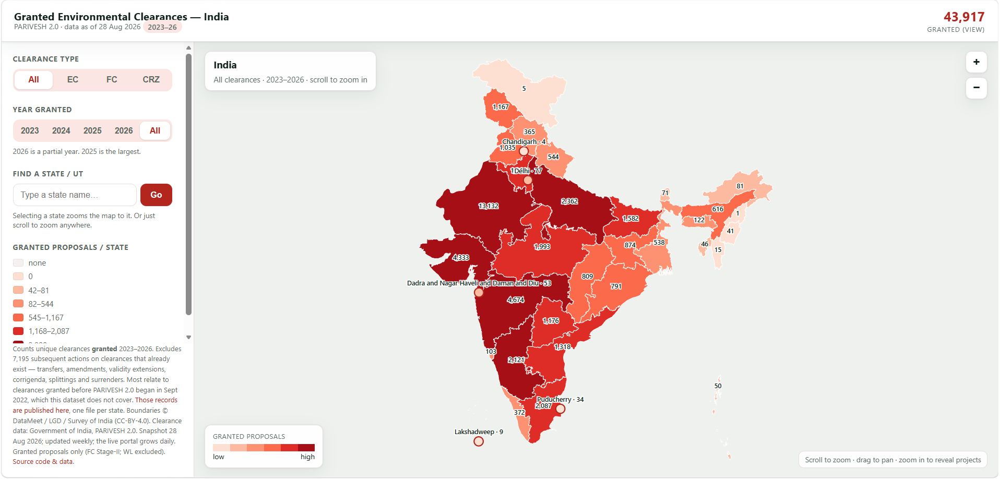

# India Environmental Clearances — Interactive Map

An interactive map of every **granted** environmental (EC), forest (FC), and coastal (CRZ)
clearance in India, built from the Government of India's **PARIVESH 2.0** open data.



**Live demo:** https://captainsai2105-cell.github.io/india-environmental-clearances-map/ · **Method & write-up:** [ProjectNotes.md](ProjectNotes.md)

---

## What it shows

- **~43,700 unique clearances granted (2023–2026)** — EC ~35,600 · FC (Stage-II) ~7,600 ·
  CRZ ~435, as at the **25 Aug 2026** refresh.

  > **These numbers grow every week.** A scheduled job reconciles the map against PARIVESH
  > each Sunday, and the portal itself is updated continuously, so the totals here are a
  > point-in-time reading, not a fixed figure. The current numbers always live in
  > **[`map_v1/data_meta.json`](map_v1/data_meta.json)** — which is generated by each run —
  > and are shown in the map's own header. Treat those as authoritative and this bullet as
  > indicative.

  The count excludes subsequent actions on clearances that already exist — transfers,
  amendments, validity extensions, corrigenda, splittings and surrenders (~7,200 records).
  Those are published separately under `map_v1/proposals_excluded/`, so the figure always
  reconciles: **shown + excluded = every granted-status record in PARIVESH 2.0**.
  *(Earlier versions of this README quoted 50,185, which counted both together. The
  distinction follows MoEFCC's own dashboard, which reports "EC" and "EC Transfer" as
  separate figures rather than adding them.)*
- **Hero:** India choropleth of granted proposals per state/UT.
- **Drill:** scroll/drag to zoom (QGIS-style); individual projects appear as you zoom in.
- **Filter:** by clearance type (All / EC / FC / CRZ) and year (2023–2026).
- **Hover a project** for its name, type, area (hectares), grant date, and proponent.

## Run locally

No build step, no dependencies — plain HTML/JS with inline SVG + Canvas:

```bash
python -m http.server 8137 --directory map_v1
# then open http://localhost:8137
```

## How it was built

Full methodology, data reconciliation, and limitations are in **[ProjectNotes.md](ProjectNotes.md)**.
In brief: pulled 67,633 project boundaries from PARIVESH 2.0's GIS server (working around a
broken TLS chain, four coordinate systems, and error-as-HTTP-200 quirks), filtered to *granted*
proposals, **derived project areas from geometry**, enriched proponent names via the metadata
API, joined to DataMeet state boundaries, and rendered a dependency-free interactive map.
Project data is **lazy-loaded per state** (one small file each) for a fast first paint —
search or click a state to isolate and zoom to it, then click any project for its details.

## Important caveats (please read before drawing conclusions)

- **Refreshed weekly, not live** — a scheduled job reconciles the map against
  PARIVESH every Sunday night; the portal itself updates daily. The map header
  carries the date of the data it is actually showing.
- **Overlap with a protected area is _not_ a violation**, and **a granted clearance is _not_
  wrongdoing.** This is a transparency/accessibility tool, not an accusation.
- **Wildlife (WL) clearances are excluded** — the public data offers no clean approve/reject
  signal (all logged as "DISPOSED").
- **You cannot derive a rejection/approval _rate_** from this data — it's a geometry layer, not
  a complete application registry (see [ProjectNotes.md](ProjectNotes.md) §5.2).

## Data & attribution

- Clearance data © **Government of India, [PARIVESH 2.0](https://parivesh.nic.in)**.
- Administrative boundaries © **DataMeet / LGD / Survey of India (CC-BY-4.0)**, via
  [india-geodata](https://github.com/yashveeeeeeer/india-geodata).
- This is an **independent, personal project on public data** — not affiliated with, or
  produced for, any employer or the Government of India.

## License

Code: **MIT** (see [LICENSE](LICENSE)). Data: subject to the sources above.
